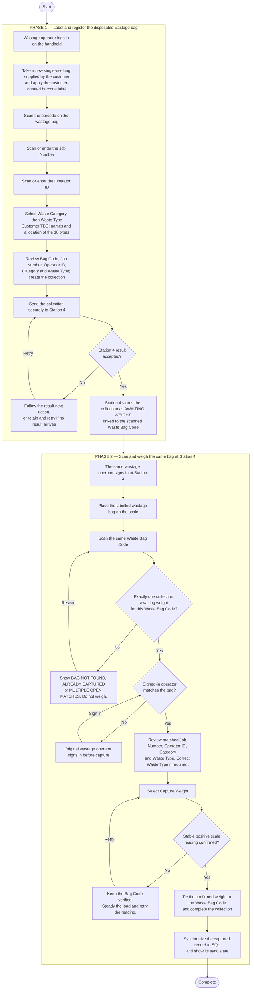

# PPNAM Station 4 — Final Wastage Bag Process

> Converted from `PPNAM-Station-4-Final-Wastage-Bag-Process-Flow.pdf` using
> [microsoft/markitdown](https://github.com/microsoft/markitdown).

Single-use bag | Customer label | Job and operator capture | Waste type selection | Confirmed scale weight

---

## Phase 1 — Label and register the disposable wastage bag

Performed on the handheld (this Android app).

1. Wastage operator logs in on the handheld.
2. Take a new single-use wastage bag supplied by the customer and apply the
   customer-created barcode label.
3. Scan the barcode on the wastage bag.
4. Scan or enter the **Job Number**.
5. Scan or enter the **Operator ID**.
6. Select the **Waste Category**, then select the **Waste Type** from the existing list.
   - ⚠️ **Customer TBC:** category names and the allocation of the existing 18 waste
     types still require customer confirmation.
7. Review the Waste Bag Code, Job Number, Operator ID, Category and Waste Type,
   then create the collection.
8. Send the collection securely to Station 4.
9. **Station 4 result accepted?**
   - **No** → follow the result's next action, or retain and retry if no result arrives.
   - **Yes** → Station 4 stores the collection as **AWAITING WEIGHT**, linked to the
     scanned Waste Bag Code.

## Phase 2 — Scan and weigh the same bag at Station 4

Performed at the Station 4 scale terminal.

1. The same wastage operator signs in at Station 4.
2. Place the labelled wastage bag on the scale.
3. Scan the same **Waste Bag Code**.
4. **Exactly one collection awaiting weight for this Waste Bag Code?**
   - **No** → show `BAG NOT FOUND`, `ALREADY CAPTURED` or `MULTIPLE OPEN MATCHES`.
     **Do not weigh.** Rescan.
   - **Yes** → continue.
5. **Signed-in operator matches the bag?**
   - **No** → the original wastage operator signs in before capture.
   - **Yes** → continue.
6. Review the matched Job Number, Operator ID, Category and Waste Type.
   Correct the Waste Type if required.
7. Select **Capture Weight**.
8. **Stable positive scale reading confirmed?**
   - **No** → keep the Bag Code verified, steady the load and retry the reading.
   - **Yes** → continue.
9. Tie the confirmed weight to the Waste Bag Code and complete the collection.
10. Synchronize the captured record to SQL and show its sync state. **Complete.**

---

## Flow diagram

---

## Control points

- Each wastage bag is **single-use** and is never treated as a reusable coded bag.
- The customer-created barcode has **no business meaning and no configured allow-list**;
  it is the temporary key that links this bag's registration and confirmed weight.
- **No machine barcode is scanned.**
- The **same wastage operator** and a **fresh, stable, positive scale reading** remain required.
- Waste categories and type allocation **await customer confirmation**; the existing
  **18 waste types remain unchanged**.
